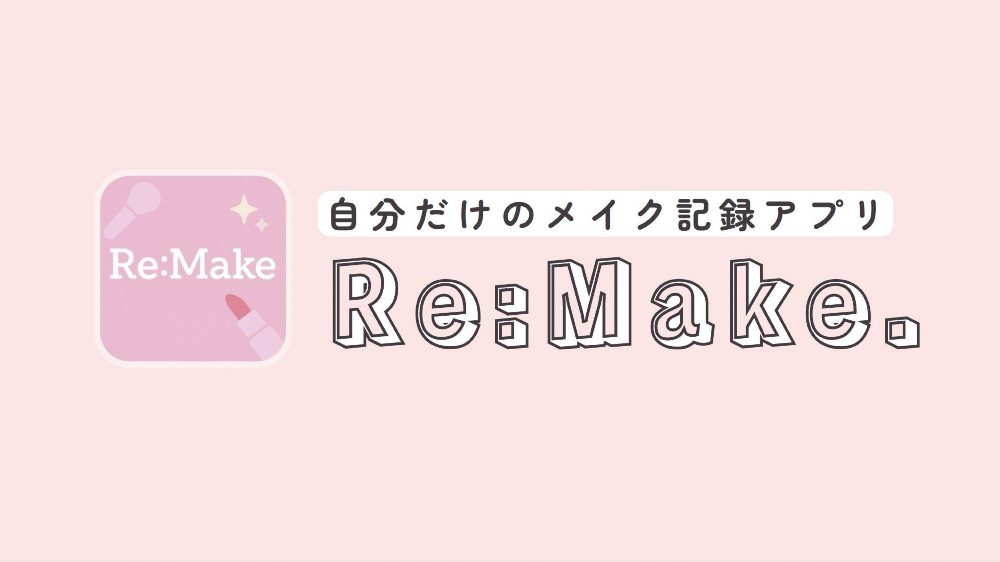
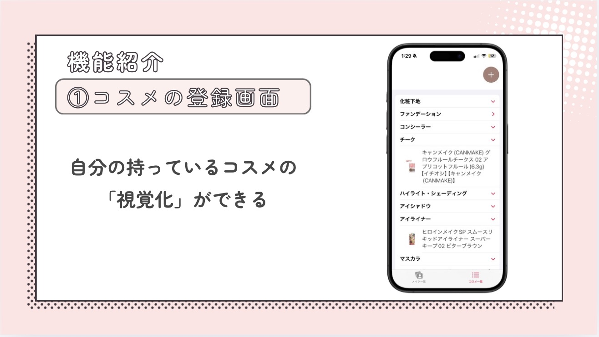
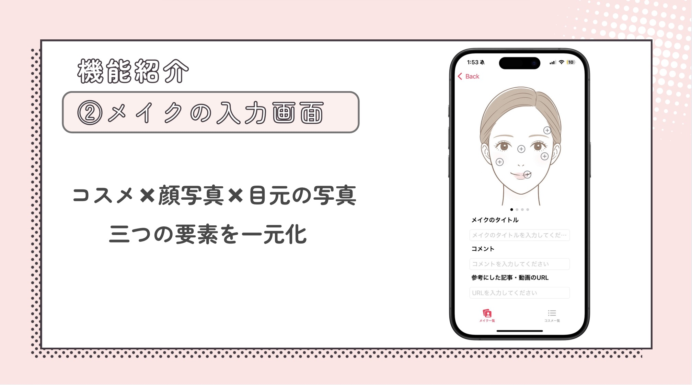
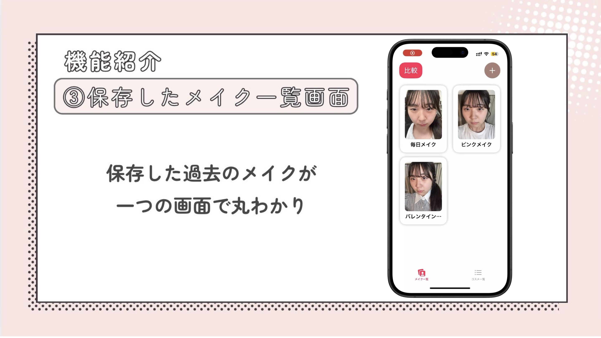
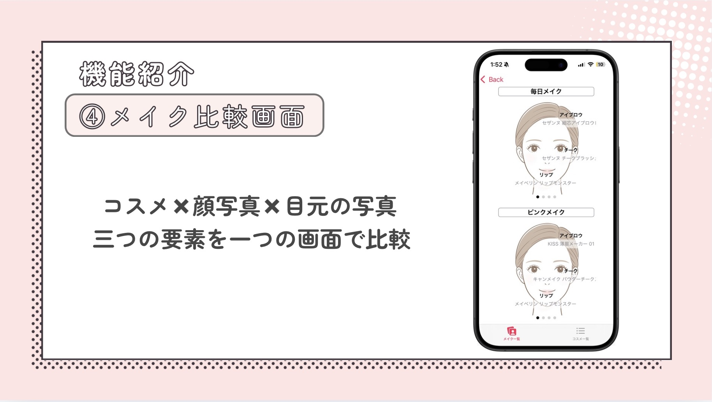
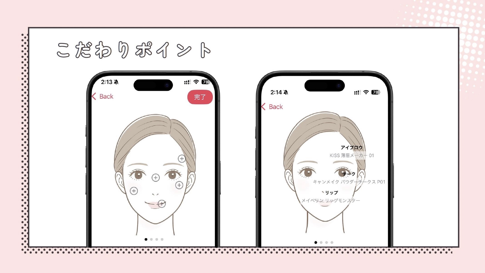
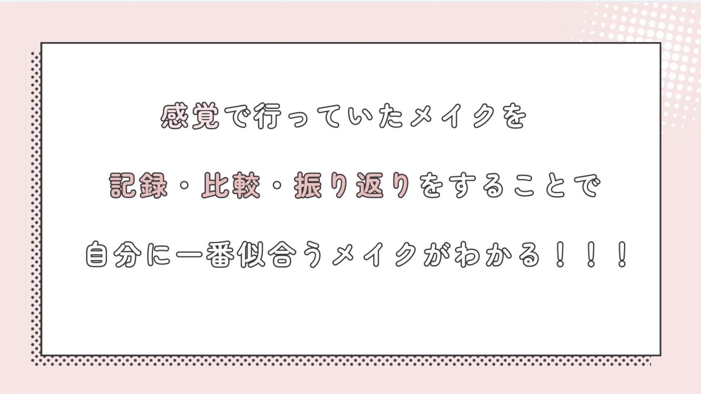

# ReMake

メイク（化粧）を写真とコスメ情報つきで記録・管理・比較できる iOS アプリです。
「使ったコスメを部位ごとに記録し、後から見返したり、複数のメイクを並べて比べたりする」ことを目的としています。

## 概要

ReMake は次のような流れで使うメイク記録アプリです。

1. **マイコスメを登録** — 手持ちのコスメをブランド・商品名・色番・カテゴリ別に登録
2. **メイクを記録** — 顔・目元の写真を撮り、部位ごとに「どのコスメを使ったか」を登録
3. **一覧・詳細で見返す** — 保存したメイクをグリッド一覧やカード詳細で閲覧
4. **2つのメイクを比較** — 過去のメイクを2件選んで並べて比較

## 主な機能

- **コスメ管理**
  - 化粧下地・ファンデーション・コンシーラー・チーク・ハイライト/シェーディング・アイシャドウ・アイライナー・マスカラ・カラコン・アイブロウ・リップの11カテゴリに対応
  - カテゴリごとに折りたたみ表示（DisclosureGroup）、スワイプで削除
- **メイク記録の作成**
  - 顔イラスト・目元イラスト上の各部位に配置した「＋」ボタンから、登録済みコスメを選択
  - ベースメイクは「化粧下地・ファンデーション・コンシーラー」をまとめて選択可能
  - 顔全体・目元の写真をカメラで撮影して添付（撮影画像の向きを自動補正）
  - メイクのタイトル・コメント・参考にした記事/動画のURLを記録
- **メイク一覧**
  - 保存済みメイクを2列のカードグリッドで表示
  - カードから詳細画面へ遷移
- **メイク詳細**
  - 顔/目元のイラスト・撮影写真を横スワイプで切り替え、各部位に使ったコスメを重ねて表示
- **比較モード**
  - 一覧から最大2件を選択し、並べて比較表示

## 技術スタック

- **言語**: Swift 5.0
- **UI フレームワーク**: SwiftUI
- **アーキテクチャ**: MVVM（`@MainActor final class ... : ObservableObject` の ViewModel）
- **データ永続化**: SwiftData（`@Model` / `@Query` / `ModelContainer`）
- **カメラ連携**: UIKit の `UIImagePickerController` を `UIViewControllerRepresentable` で SwiftUI に統合
- **画像処理**: Core Image（`CIImage` / `CIContext`）による撮影画像の向き補正
- **テスト**: ユニットテストは swift-testing（`import Testing`）、UI テストは XCTest
- **対象 OS**: iOS 18.5 以上
- **開発環境**: Xcode

## プロジェクト構成

SwiftData をベースに、Model / View / ViewModel を分離した MVVM 構成です。
ViewModel は SwiftData を直接クエリせず、View が `@Query` で取得した結果やメソッド引数として
`ModelContext` を受け取ります。

```
ReMake/
├── ReMakeApp.swift                  # アプリのエントリーポイント。ModelContainer を初期化
├── Model/
│   ├── CosmeticModel.swift          # Cosmetic（コスメ）の @Model 定義
│   └── MakeupRecordModel.swift      # MakeupRecord（メイク記録）の @Model 定義
├── View/
│   ├── MainTabView.swift            # 「メイク一覧」「コスメ一覧」のタブ切り替え
│   ├── InputCosmeView.swift         # コスメ管理画面
│   ├── InputMakeupView.swift        # メイク記録の作成画面（中核）
│   ├── MakeupDetailView.swift       # 保存済みメイクの詳細表示画面（閲覧専用）
│   ├── CompareMakeupView.swift      # 2件のメイクを並べて比較する画面
│   ├── SavedMakeListView.swift      # メイク一覧（グリッド表示・比較モードの起点）
│   └── Components/
│       ├── ImagePaper.swift         # 横スワイプ画像ビューア（ImagePager）共通部品
│       └── Camera.swift             # カメラ機能（UIImagePickerController 連携・向き補正）
└── ViewModel/
    ├── InputCosmeViewModel.swift    # コスメの追加・削除・カテゴリ別整理
    ├── InputMakeupViewModel.swift   # メイク記録の作成・コスメ選択・保存
    ├── MakeupDetailViewModel.swift  # 保存済みメイクの表示用データ変換
    ├── SavedMakeListViewModel.swift # 一覧・比較モード・選択状態の管理
    └── CameraLaunchViewModel.swift  # カメラ起動状態と撮影画像の受け渡し
```

### データモデル

- **`Cosmetic`** — 1つのコスメ（`brand` / `product` / `color` / `category`）。`category` は自由文字列で、メイク記録とコスメを結びつけるキーとして使われます。
- **`MakeupRecord`** — 1つのメイク記録（`name` / `comment` / `url` / 顔・目元の画像データ / 部位ごとに使ったコスメ `selectedItems`）。`selectedItems` は部位名をキー、`", "` 区切りのコスメ名を値とした辞書です。

## ビルド・実行・テスト

Xcode で `ReMake.xcodeproj` を開き、実機または iOS 18.5 以上のシミュレータを選択して Run（⌘R）で実行できます。
コマンドラインからは `xcodebuild`（スキーム: `ReMake`）を使います。

```bash
# ビルド
xcodebuild -project ReMake.xcodeproj -scheme ReMake \
  -destination 'platform=iOS Simulator,name=iPhone 16' build

# テスト（ユニット + UI）
xcodebuild -project ReMake.xcodeproj -scheme ReMake \
  -destination 'platform=iOS Simulator,name=iPhone 16' test
```

> カメラ機能は実機でのみ動作します（シミュレータではカメラを利用できません）。

## ポートフォリオ

<table>
  <tr>
    <td></td>
    <td></td>
  </tr>
  <tr>
    <td></td>
    <td></td>
  </tr>
  <tr>
    <td></td>
    <td></td>
  </tr>
  <tr>
    <td></td>
    <td></td>
  </tr>
</table>
